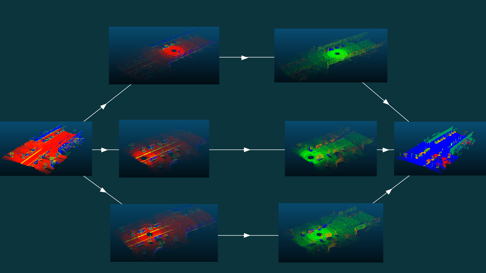

# 3DPointCloudClassification
Challenge to classify 3D point clouds of cities into Ground - Building - Poles - Pedestrians - Cars - Vegetation. The challenge description and the dataset are available [here](https://npm3d.fr/benchmark-for-master-course-on-3d-point-clouds). The best results ended can be summarized as follows, with IoU for Intersection over Union:

|     | Average | Cars | Pedestrians | Ground | Building | Vegetation | Pole |
| --- |:-------:| :---:| :----------:| :-----:| :-------:| :---------:| :---:|
|*Rank* | 3       | 1    | 3           | 1      | 3        | 3          | 3    |
|*IoU* | 53.8    | 85.5 | 5.5         | 97.7   | 77.1     | 38.1       | 19.0 |


The approach considered here is coming from the [RangeNet++](#RangeNet++) paper. This time the algorithm is applied on outdoor point cloud instead of LiDAR scans. I advise the reader to have a look to the [report](./report.pdf), that I have made, that explains how this transfer is done. You can see here the overall pipeline:

<table style="width:100%; table-layout:fixed;">
	<tr>
		<td></td>
	</tr>
	<tr>
		<td>The outdoor pipeline is first split into virtual LiDAR scans (far left). Then each virtual scan is passed throught the RangeNet++ separately (middle left to middle right). Finally, the predictions are merged together into the original point cloud (far right). Here 1000 virtual scans have been used to get the predictions.</td>
	</tr>
</table>


<table style="width:100%; table-layout:fixed;">
	<tr>
		<td></td>
	</tr>
	<tr>
		<td>Animation showing on the test point cloud how the virtual scans gradually help to label the entire dataset.</td>
	</tr>
</table>


## Organization
This repository is organised into two main folders:
- [classifier_3D](./classifier_3D/) is the folder where feature classification can be done. Among them, you can use: verticality, linearity, planarity, sphericity, x, y, z. 
- [range_net](./range_net/) is the folder where the transfer from outdoor point cloud to LiDAR is being done. Feel free to have a look to the [README.md](./range_net/README.md) file of that folder to have a more complete description.

## How to install
You can install this repository in your personnal computer by cloning it and installing the package in editable mode:
```Bash
pip install -e .
```

If you want to use a Docker container with Visual Studio Code, a [.devcontainer](./.devcontainer/) has been created for you :)

## References
#### RangeNet++
[A. Milioto, I. Vizzo, J. Behley, and C. Stachniss. RangeNet++: Fast and Accurate LiDAR Semantic Segmentation. In IEEE/RSJ Intl. Conf. on Intelligent Robots and Systems (IROS), 2019.](https://github.com/PRBonn/lidar-bonnetal)